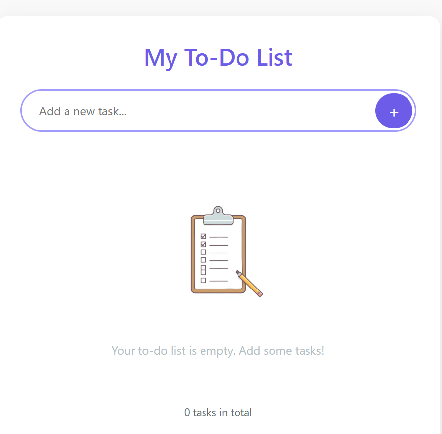
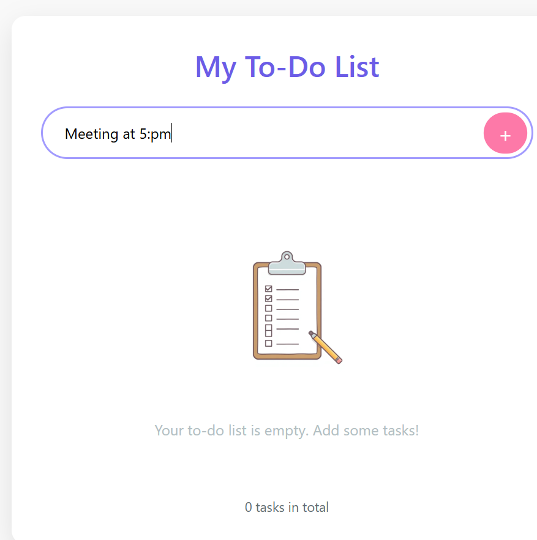
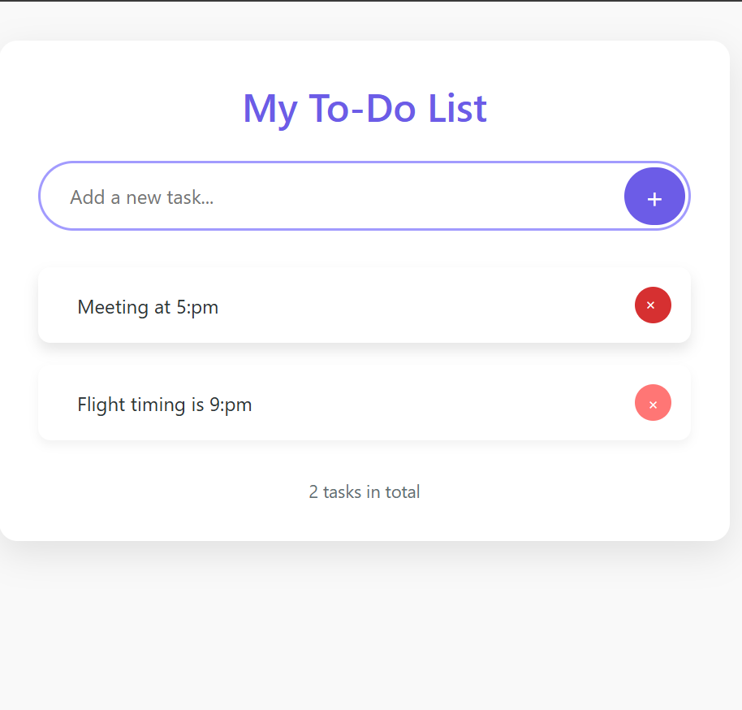

# 📝 To-Do List Web App

A clean, modern, and responsive To-Do List app built using **HTML**, **CSS**, and **JavaScript**. This app helps you organize your daily tasks with a simple, user-friendly interface.

---

## 📸 Screenshots

### 📍 Home Screen


### ✅ Tasks Added


### 🌙 Completed Tasks View


---

## ✨ Features

- ✅ Add new tasks quickly
- 🗑️ Delete tasks with one click
- ✔️ Mark tasks as completed
- 💾 Saves data using localStorage
- 💻 Responsive design (mobile-friendly)

---

## 💻 Technologies Used

- **HTML5**
- **CSS3**
- **JavaScript**

---

## 🚀 Getting Started

To run this project locally:

1. **Clone the repository:**
```bash
git clone https://github.com/your-username/todo-list.git
